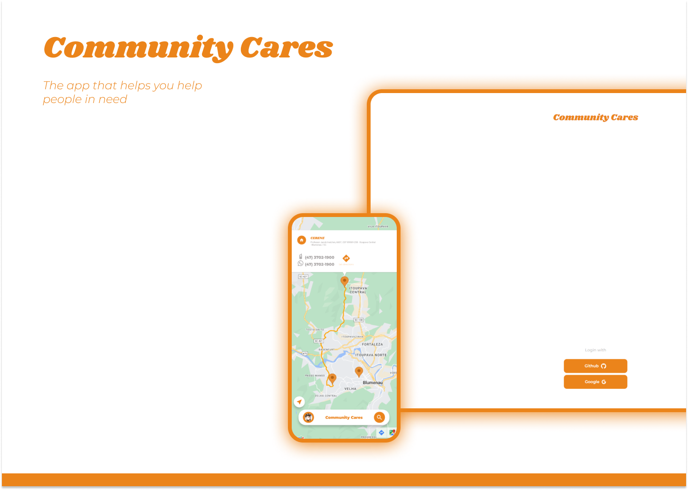

<div align="center">

**Uma ponte entre a solidariedade e quem precisa / A bridge between solidarity and those in need**

[](https://expo.dev/)
[](https://reactnative.dev/)
[](https://www.typescriptlang.org/)

</div>

---

## 📖 Sobre o Projeto / About the Project

**Community Cares** é um aplicativo mobile de impacto social desenvolvido para conectar pessoas em situação de vulnerabilidade com recursos essenciais de alimentação e abrigo. Através de uma interface intuitiva e acessível, o app mapeia e disponibiliza em tempo real a localização de cozinhas comunitárias, cozinhas solidárias, abrigos e hospitais que oferecem assistência gratuita.

**Community Cares** is a social impact mobile application developed to connect people in vulnerable situations with essential food and shelter resources. Through an intuitive and accessible interface, the app maps and provides real-time locations of community kitchens, solidarity kitchens, shelters, and hospitals that offer free assistance.

### 🎯 Impacto Social / Social Impact

- **Combate à fome** / **Fighting hunger**: Facilita o acesso a refeições gratuitas para pessoas em situação de rua e vulnerabilidade social
- **Inclusão digital** / **Digital inclusion**: Interface bilíngue (Português/Inglês) para alcançar diferentes públicos
- **Transparência** / **Transparency**: Informações verificadas e atualizadas sobre locais de apoio
- **Autonomia** / **Autonomy**: Empodera usuários a encontrarem recursos por conta própria

---

## ✨ Funcionalidades / Features

### 🗺️ Mapeamento Interativo / Interactive Mapping

- **Visualização em mapa** com localização em tempo real de estabelecimentos de apoio
- **Real-time map visualization** of support establishments
- **Geolocalização** para encontrar recursos próximos à sua posição atual
- **Geolocation** to find resources near your current position
- **Marcadores personalizados** indicando diferentes tipos de estabelecimentos
- **Custom markers** indicating different types of establishments

### 🔍 Sistema de Filtros / Filter System

- **Filtros inteligentes** por tipo de estabelecimento:
  - 🍲 Cozinha Comunitária / Community Kitchen
  - 🥘 Cozinha Solidária / Solidarity Kitchen
  - 🏠 Abrigo / Shelter
  - 🏥 Hospital / Hospital
- **Busca personalizada** para encontrar exatamente o que você precisa
- **Customized search** to find exactly what you need

### 🌐 Acessibilidade / Accessibility

- **Interface bilíngue** (Português/Inglês) com alternância automática
- **Bilingual interface** (Portuguese/English) with automatic switching
- **Design responsivo** otimizado para diferentes tamanhos de tela
- **Responsive design** optimized for different screen sizes
- **Navegação intuitiva** pensada para usuários com diferentes níveis de alfabetização digital
- **Intuitive navigation** designed for users with different levels of digital literacy

### 👤 Perfil de Usuário / User Profile

- **Autenticação via GitHub** para personalização da experiência
- **GitHub authentication** for personalized experience
- **Perguntas frequentes** para auxiliar novos usuários
- **FAQ section** to help new users
- **Histórico de localização** (em desenvolvimento)
- **Location history** (in development)

### 📍 Informações Detalhadas / Detailed Information

- **Endereço completo** de cada estabelecimento
- **Full address** of each establishment
- **Informações de contato** quando disponíveis
- **Contact information** when available
- **Direções** para navegação até o local
- **Directions** for navigation to the location

---

## 👨‍💻 Tecnologias / Technologies

### Frontend & Mobile

- **[Expo](https://expo.dev/)** - Framework para desenvolvimento React Native
- **[React Native](https://reactnative.dev/)** - Framework mobile multiplataforma
- **[TypeScript](https://www.typescriptlang.org/)** - Superset JavaScript com tipagem estática
- **[Expo Router](https://docs.expo.dev/router/introduction/)** - Navegação file-based
- **[Expo Maps](https://docs.expo.dev/versions/latest/sdk/map-view/)** - Integração com mapas nativos

### APIs & Serviços / APIs & Services

- **[Axios](https://axios-http.com/)** - Cliente HTTP para requisições
- **[Expo Location](https://docs.expo.dev/versions/latest/sdk/location/)** - Serviços de geolocalização
- **GitHub OAuth** - Autenticação de usuários

### UI/UX

- **[Expo Image](https://docs.expo.dev/versions/latest/sdk/image/)** - Componente otimizado de imagens
- **[Vector Icons](https://icons.expo.fyi/)** - Ícones personalizáveis
- **Custom Fonts** - Montserrat & Shrikhand para identidade visual

### Qualidade de Código / Code Quality

- **[Jest](https://jestjs.io/)** - Framework de testes unitários
- **[ESLint](https://eslint.org/)** - Linter para qualidade de código
- **TypeScript Strict Mode** - Tipagem rigorosa para maior confiabilidade

---

## 🚀 Como Executar / How to Run

### Pré-requisitos / Prerequisites

```bash
# Node.js 16+ e npm/yarn
# Android Studio (para emulador Android)
# JDK 17
```

### Instalação / Installation

1. **Clone o repositório / Clone the repository**

```bash
git clone https://github.com/your-username/community-cares.git
cd community-cares
```

2. **Instale as dependências / Install dependencies**

```bash
npm install
# ou / or
yarn install
```

3. **Configure o Java (Windows)**

```bash
# Baixe e instale a JDK 17
# Download and install JDK 17
# https://www.oracle.com/java/technologies/javase/jdk17-archive-downloads.html

# Configure JAVA_HOME
setx JAVA_HOME "C:\Program Files\Java\jdk-17"

# Adicione ao PATH / Add to PATH
setx PATH "%PATH%;%JAVA_HOME%\bin"
```

4. **Configure variáveis de ambiente / Configure environment variables**

```bash
# Crie um arquivo env.ts na raiz do projeto
# Create an env.ts file in the project root

# Adicione suas chaves de API / Add your API keys
```

### Executando o Projeto / Running the Project

**Android:**

```bash
# Abra o Android Emulator
# Open Android Emulator

# Execute a build
# Run the build
npx expo run:android
```

**iOS:**

```bash
npx expo run:ios
```

**Modo de Desenvolvimento / Development Mode:**

```bash
npx expo start
```

---

## 🧪 Testes / Testing

```bash
# Executar todos os testes / Run all tests
npm test

# Testes com cobertura / Tests with coverage
npm run test:coverage

# Modo watch / Watch mode
npm run test:watch
```

---

## 📂 Estrutura do Projeto / Project Structure

```
community-cares/
├── src/
│   ├── app/              # Rotas e telas / Routes and screens
│   ├── components/       # Componentes reutilizáveis / Reusable components
│   ├── contexts/         # Context API (autenticação, usabilidade)
│   ├── services/         # Integrações com APIs / API integrations
│   ├── interfaces/       # TypeScript interfaces e types
│   └── types/            # Type declarations
├── assets/               # Imagens, fontes e recursos estáticos
├── android/              # Configurações nativas Android
└── coverage/             # Relatórios de cobertura de testes
```

---

## 🗺️ Roadmap

- [x] Mapeamento de locais com geolocalização
- [x] Sistema de filtros por tipo de estabelecimento
- [x] Autenticação de usuários via GitHub
- [x] Interface bilíngue (PT/EN)
- [ ] Modo offline com cache de dados
- [ ] Sistema de avaliações e comentários
- [ ] Notificações push para novos locais
- [ ] Histórico de locais visitados
- [ ] Compartilhamento de locais via redes sociais
- [ ] Integração com rotas de transporte público

---

## 🤝 Como Contribuir / How to Contribute

Contribuições são sempre bem-vindas! / Contributions are always welcome!

1. Fork o projeto / Fork the project
2. Crie uma branch para sua feature (`git checkout -b feature/AmazingFeature`)
3. Commit suas mudanças (`git commit -m 'Add some AmazingFeature'`)
4. Push para a branch (`git push origin feature/AmazingFeature`)
5. Abra um Pull Request

---

## 📄 Licença / License

Este projeto está sob a licença MIT. Veja o arquivo [LICENSE](LICENSE) para mais detalhes.

This project is under the MIT license. See the [LICENSE](LICENSE) file for more details.

---

## 🧑🏾‍💻 Autor / Author

**Matheus Gomes de Souza**

Desenvolvedor apaixonado por tecnologia e impacto social 🚀

Developer passionate about technology and social impact 🚀

[](https://www.linkedin.com/in/matheus-gomes-de-souza/)
[](mailto:matheusg_souza@outlook.com)

---

<div align="center">

**Feito com 🧡 para fazer a diferença na comunidade**

**Made with 🧡 to make a difference in the community**

</div>
